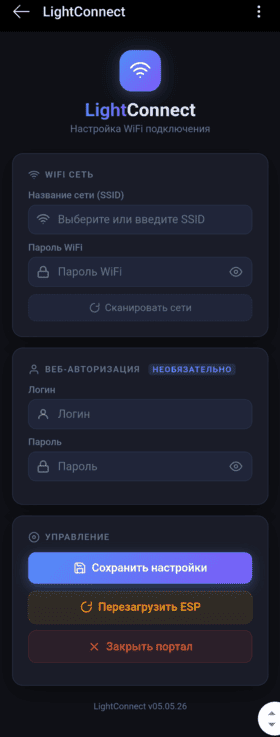
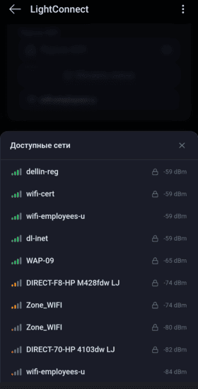

## LightConnect

Красивый портал настройки для первоначальной конфигурации WiFi. Поддерживает сканирование доступных сетей, выбор SSID, ввод пароля WiFi, а также опциональную установку логина и пароля для веб-интерфейса.

###  

### Совместимость

ESP8266, ESP32

Arduino IDE 1 и 2 версий

 
_Проект полностью открыт и распространяется по лицензии MIT._

Ссылки на [GitFlic](https://gitflic.ru/project/otto/lightconnect) и [GitHub](https://github.com/Otto17/LightConnect).

---

### Краткое описание

При подключении к точке доступа "**LightConnect**" автоматически откроется страница конфигурации (если не открылась - перейти: _192.168.4.1_).

Кнопка **"Сохранить настройки"** отправляет введённые данные в EEPROM или Preferences (NVS).

Кнопка **"Перезагрузить ESP"** перезагружает ESP8266/ESP32.

Кнопка **"Закрыть портал"** просто завершает работу портала.

---

### Методы

```cpp
МЕТОД                                    ОПИСАНИЕ
LightConnect.start()			Запускает портал (неблокирующий)
LightConnect.stop()				Останавливает портал
LightConnect.tick()				Вызывать в loop(), возвращает true при завершении
LightConnect.run(ms)			Блокирующий запуск с таймаутом (по умолчанию 60 000 мс)
LightConnect.status()			Код завершения
LightConnect.setAPName(name)	Имя точки доступа (до start())
LightConnect.setAPPass(pass)	Пароль AP ≥ 8 символов (до start())
```

###  

### Коды статуса

```cpp
КОНСТАНТА    ЗНАЧЕНИЕ   ОПИСАНИЕ
LC_IDLE			0		Ожидание
LC_SUBMIT		1		Данные сохранены
LC_REBOOT		2		Запрошена перезагрузка
LC_EXIT			3		Закрыт вручную
LC_TIMEOUT		4		Таймаут
```

###  

### Поля с данными

```cpp
ПОЛЕ
           РАЗМЕР    ОПИСАНИЕ
lcCfg.ssid		 64		SSID WiFi сети
lcCfg.pass		 64		Пароль WiFi
lcCfg.webLogin	 32		Логин веб-интерфейса
lcCfg.webPass	 32		Пароль веб-интерфейса
```

---

### Примеры.

**Асинхронный&#x20;**(_портал работает в фоне, loop() свободен_)

```cpp
#ifdef ESP8266
  #include <ESP8266WiFi.h>
#else
  #include <WiFi.h>
#endif

#include <LightConnect.h>

void setup() {
  Serial.begin(115200);
  delay(500);
  Serial.println("\n[LC] Запуск портала...");

  // Опционально: задать своё имя AP перед стартом
  // LightConnect.setAPName("MyDevice Setup");

  LightConnect.start(); // Запускаем портал (неблокирующий)
}

void loop() {
  // Вызываем tick() — возвращает true, когда портал завершил работу
  if (LightConnect.tick()) {

    Serial.print("[LC] Статус: ");
    Serial.println(LightConnect.status());

    switch (LightConnect.status()) {

      case LC_SUBMIT:
        Serial.println("[LC] Настройки сохранены!");
        Serial.print("  SSID:     "); Serial.println(lcCfg.ssid);
        Serial.print("  Pass:     "); Serial.println(lcCfg.pass);
        Serial.print("  WebLogin: "); Serial.println(lcCfg.webLogin);
        Serial.print("  WebPass:  "); Serial.println(lcCfg.webPass);
        // Здесь: нужно сохранить данные в EEPROM/Preferences, подключиться к WiFi...
        break;

      case LC_REBOOT:
        Serial.println("[LC] Перезагрузка по запросу из WEB...");
        delay(500);
        ESP.restart();
        break;

      case LC_EXIT:
        Serial.println("[LC] Портал закрыт вручную.");
        break;

      default:
        break;
    }
  }

  // Здесь выполняется остальная логика проекта...
}
```

###  

**Блокирующий&#x20;**(&#x432;_&#x44B;полнение кода останавливается до закрытия портала или таймаута_)

```cpp
#ifdef ESP8266
  #include <ESP8266WiFi.h>
#else
  #include <WiFi.h>
#endif

#include <LightConnect.h>

void setup() {
  Serial.begin(115200);
  delay(500);

  Serial.println("[LC] Запуск портала (блокирующий, таймаут 2 мин)...");
  LightConnect.run(120000); // Блокируем до завершения или таймаута

  // После выхода из run() портал уже остановлен
  Serial.print("[LC] Статус: ");
  Serial.println(LightConnect.status());

  if (LightConnect.status() == LC_SUBMIT) {
    Serial.println("[LC] Данные получены:");
    Serial.print("  SSID:     "); Serial.println(lcCfg.ssid);
    Serial.print("  Pass:     "); Serial.println(lcCfg.pass);
    Serial.print("  WebLogin: "); Serial.println(lcCfg.webLogin);
    Serial.print("  WebPass:  "); Serial.println(lcCfg.webPass);
  }

  if (LightConnect.status() == LC_TIMEOUT) {
    Serial.println("[LC] Таймаут — портал закрыт автоматически.");
  }

  if (LightConnect.status() == LC_REBOOT) {
    Serial.println("[LC] Перезагрузка...");
    delay(500);
    ESP.restart();
  }
}

void loop() {
  // Основная логика программы...
}
```

###  

**Полный пример** (запуск портала → сохранение в память → подключение к WiFi)

```cpp
#ifdef ESP8266
  #include <ESP8266WiFi.h>
  #include <EEPROM.h>
  #define USE_EEPROM
#else
  #include <WiFi.h>
  #include <Preferences.h>
  Preferences prefs;
#endif

#include <LightConnect.h>

// Размер структуры в EEPROM (для ESP8266)
#define EEPROM_SIZE sizeof(LightConnectCfg)

// Прототипы
void saveConfig();
void loadConfig();
bool connectWiFi(uint32_t timeout = 15000);

void setup() {
  Serial.begin(115200);
  delay(500);
  Serial.println("\n==============================");
  Serial.println("  LightConnect полный пример");
  Serial.println("==============================\n");

  // Загружаем сохранённые настройки
  loadConfig();

  Serial.print("[CFG] SSID: ");     Serial.println(lcCfg.ssid);
  Serial.print("[CFG] WebLogin: "); Serial.println(lcCfg.webLogin);

  // Пробуем подключиться к сохранённой сети
  bool connected = false;
  if (strlen(lcCfg.ssid) > 0) {
    Serial.println("[WiFi] Подключение к сохранённой сети...");
    connected = connectWiFi();
  }

  // Если не подключились — запускаем портал
  if (!connected) {
    Serial.println("[LC] Запуск портала настройки...");
    LightConnect.setAPName("LightConnect");
    LightConnect.run(300000); // 5 минут таймаут

    switch (LightConnect.status()) {
      case LC_SUBMIT:
        Serial.println("[LC] Настройки сохранены, подключение...");
        saveConfig();
        if (connectWiFi()) {
          Serial.println("[WiFi] Подключено!");
        } else {
          Serial.println("[WiFi] Не удалось подключиться.");
        }
        break;

      case LC_REBOOT:
        Serial.println("[LC] Перезагрузка...");
        delay(300);
        ESP.restart();
        break;

      case LC_TIMEOUT:
        Serial.println("[LC] Таймаут портала.");
        break;

      case LC_EXIT:
        Serial.println("[LC] Портал закрыт.");
        break;

      default:
        break;
    }
  }

  if (WiFi.status() == WL_CONNECTED) {
    Serial.print("[WiFi] IP: ");
    Serial.println(WiFi.localIP());
    Serial.print("[WiFi] WebLogin: "); Serial.println(lcCfg.webLogin);
    Serial.print("[WiFi] WebPass:  "); Serial.println(lcCfg.webPass);
  }
}

// Сохранение конфига
void saveConfig() {
#ifdef USE_EEPROM
  EEPROM.begin(EEPROM_SIZE + 4);
  // Маркер валидности
  EEPROM.write(0, 0xAB);
  EEPROM.write(1, 0xCD);
  EEPROM.put(2, lcCfg);
  EEPROM.commit();
  EEPROM.end();
  Serial.println("[CFG] Сохранено в EEPROM.");
#else
  prefs.begin("lc", false);
  prefs.putBytes("cfg", &lcCfg, sizeof(lcCfg));
  prefs.end();
  Serial.println("[CFG] Сохранено в Preferences.");
#endif
}

// Загрузка конфига
void loadConfig() {
  memset(&lcCfg, 0, sizeof(lcCfg)); // Обнуляем структуру

#ifdef USE_EEPROM
  EEPROM.begin(EEPROM_SIZE + 4);
  uint8_t m0 = EEPROM.read(0);
  uint8_t m1 = EEPROM.read(1);
  if (m0 == 0xAB && m1 == 0xCD) {
    EEPROM.get(2, lcCfg);
    Serial.println("[CFG] Загружено из EEPROM.");
  } else {
    Serial.println("[CFG] EEPROM пуста, используем defaults.");
  }
  EEPROM.end();
#else
  prefs.begin("lc", true);
  if (prefs.isKey("cfg")) {
    prefs.getBytes("cfg", &lcCfg, sizeof(lcCfg));
    Serial.println("[CFG] Загружено из Preferences.");
  } else {
    Serial.println("[CFG] Preferences пуста, используем defaults.");
  }
  prefs.end();
#endif
}

// Подключение к WiFi
bool connectWiFi(uint32_t timeout) {
  if (strlen(lcCfg.ssid) == 0) return false;

  WiFi.mode(WIFI_STA);
  WiFi.begin(lcCfg.ssid, lcCfg.pass);

  uint32_t start = millis();
  while (WiFi.status() != WL_CONNECTED) {
    if (millis() - start >= timeout) return false;
    delay(300);
    Serial.print(".");
  }
  Serial.println();
  return true;
}

void loop() {
  // Основная логика программы...
}
```

---

**Скриншоты:**

****
****

---

**Автор Otto, г. Омск 2026**